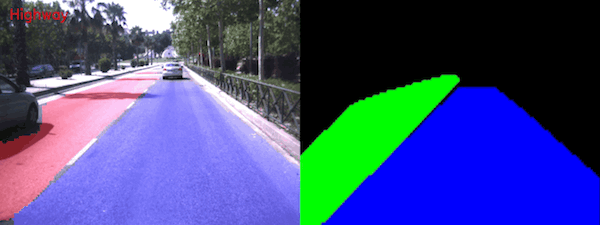

# Enhanced free space detection in multiple lanes based on single CNN with scene identification
<p align="center">

</p>
This repository contains the code for the paper "Enhanced free space detection in multiple lanes based on single CNN with scene identification", presented at the IEEE Intelligent Vehicles Symposium 2019.

## Note on the CNN part

If you are interested only in the CNN part, you can find the models and the pretrained networks in the `res` folder.

## Installation

The code has been tested with ROS Lunar and PyTorch 0.4.1. You can find an inclusive list of dependencies in the repo. They will probably contain useless dependencies.

First of all, clone the repository in your ROS environment. Some dependencies are managed by conda, install the required packages with
```
conda install --file requirements_conda.txt
```

Then, use pip for the remaining dependencies
```
pip install -r requirements_pip.txt
```

## Compiling

Compile the project with a standard `catkin_make` in your ROS environment root.

## Running the code

Two launch configuration are available in the `launch` folder. After compiling the code, they should be available with (example)

```
roslaunch ld_lsi debug
```

The difference between the debug configuration and the standard one is that with the debug view, OpenCV is used to display the output of the CNN and of the clustering algorithm.

## Citation

Coming soon.
